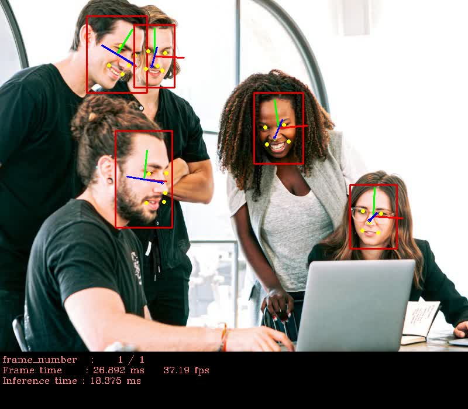
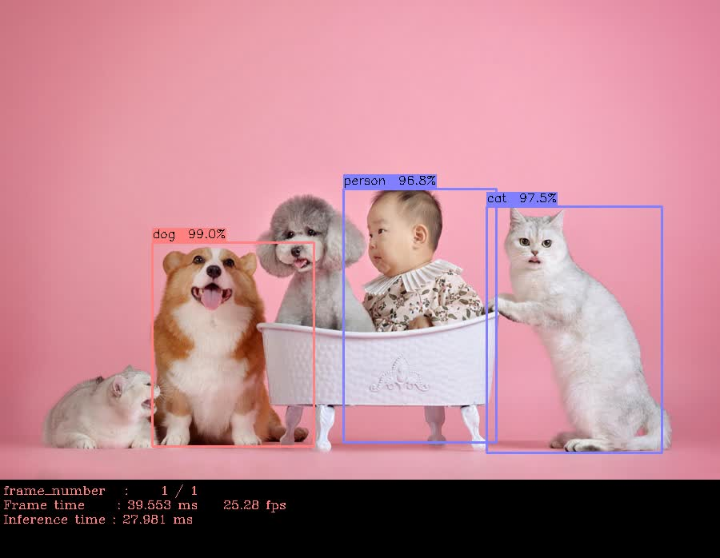

# openVINO 使用画像認識 色々

## ファイル構成

| ファイル             | 内容                                             |
|----------------------|--------------------------------------------------|
| common               | 共通処理                                         |
| face                 | 顔検出＆関連検出処理                             |
| ssd                  | SSD処理                                          |
| yolo                 | YOLO処理                                         |

## 共通処理
各処理に共通の処理を定義したファイルがあります。

## 顔検出＆関連検出処理
画像から顔部分を認識し、さらにそれぞれの顔部分に対して特徴点検出、向き検出を行います。

## SSD処理
画像をSSDを使用して色々な物体を検出します。

## YOLO処理
画像をYOLOを使用して色々な物体を検出します。

## 実行例

## 参考
openVINOのインストールについては↓こちら  
[openVINO フルパッケージをubuntuにインストール(改訂版)](https://ippei8jp.github.io/memoBlog/2020/06/16/openVINO_ubuntu_2.html)

**※ openVINO 2019には対応していません。**  
